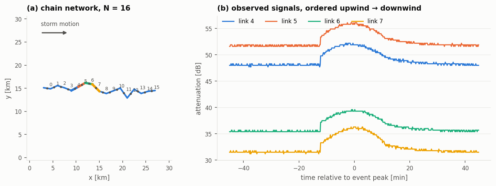

<div align="center">

# S-BSTN

**Selective Bidirectional Spatio-Temporal Network**<br/>
Forecasting weather-induced attenuation across commercial microwave link networks

[](https://doi.org/10.1109/TIM.2025.3555716)
[](LICENSE)


</div>

Commercial microwave links (CMLs), the point-to-point radio hops that carry cellular
backhaul, are attenuated by rain. Operators already log their signal levels, so a backhaul
network also works as a dense, high-rate rain sensor.

**S-BSTN forecasts that attenuation 1–5 minutes ahead, jointly for every link in a
subnetwork, using only the links' own past measurements.** It uses no radar, no numerical
weather model and no rain gauges at inference time. The forecast attenuation can then be
converted into a short-term rain map.

This repository is the reference implementation of:

> D. Jacoby, H. Messer, and J. Ostrometzky, "Spatio-Temporal Model for Predicting Multivariate
> Weather-Induced Attenuation in Wireless Networks," *IEEE Transactions on Instrumentation and
> Measurement*, vol. 74, pp. 1–13, 2025. [doi:10.1109/TIM.2025.3555716](https://doi.org/10.1109/TIM.2025.3555716)


---

## Why a spatio-temporal model

Rain is a 2-D field that is **advected** across the network while individual cells grow and
decay. Each link measures a **line integral** of that field along its path. This gives the
forecasting problem a physical structure on two coupled scales:

- **Spatial.** Rain cells are a few km across, so links further apart than the correlation
  length hardly co-vary.
- **Temporal.** Weather moves at the steering wind speed, so an upwind link *leads* a
  downwind one by `distance / speed` minutes. A source only helps a 5-minute forecast if
  its lead fits within that horizon.


S-BSTN handles each of these with its own attention mechanism:

| Physical structure | S-BSTN component |
|---|---|
| Influence is **pairwise and directional**: upwind *j* informs downwind *i*, not the reverse | **Selective Cross-Attention (SCA)** scores every ordered pair `(i, j)`, producing an `N×N` map `Λ_t` rather than one weight per sensor |
| Only links **within the correlation length and the horizon** carry information | **Selective Attention Network (SAN)**: a learned per-link threshold `τ_i` sets irrelevant sources to exactly zero |
| The relevant sources **change as the storm crosses** the window | SCA is conditioned on the recurrent encoder state, so `Λ_t` changes at every step |
| Each forecast step needs **different past lags** | **Bi-Temporal Attention (Bi-TA)** gives every lead `t'` its own distribution over past steps |
| **Onset and decay** look different depending on the direction in which the window is read | **Bidirectional** encoder: separate forward and backward attention and LSTMs, fused only at the context vector |

See **[docs/spatiotemporal.md](docs/spatiotemporal.md)** for the physics and
**[docs/architecture.md](docs/architecture.md)** for the equations, tensor shapes and design
details.

## Installation

```bash
git clone https://github.com/drorjac/S-BSTN.git
cd S-BSTN
pip install -e .            # or: pip install -e ".[dev]" for tests and linting
```

Requires Python ≥ 3.10 and PyTorch ≥ 2.0. A GPU is optional. For these model sizes the
encoder's step-by-step loop means that a CPU is usually as fast.

## Quick start

```bash
# simulate a 12-link CML network, train S-BSTN, save the checkpoint and figures (~2 min on CPU)
sbstn train --config configs/quickstart.yaml --out runs/quickstart

sbstn info    --checkpoint runs/quickstart/sbstn.pt
sbstn predict --checkpoint runs/quickstart/sbstn.pt --input window.npy   # (N, T) dB -> (N, H) dB
```

Each training run writes:

```
runs/quickstart/
  sbstn.pt                 checkpoint: weights, scaler, model config, link geometry
  results.json             config, data diagnostics, per-horizon test metrics, training history
  test_predictions.npz     test windows, truth and forecasts in dB
  figures/                 network, rain event, spatio-temporal structure, attention maps, training curves
```

## Training

All settings are in a YAML config ([`configs/base.yaml`](configs/base.yaml),
[`configs/quickstart.yaml`](configs/quickstart.yaml)), in four sections: `sim`, `data`,
`model` and `train`. Any value can be overridden on the command line:

```bash
sbstn train --config configs/base.yaml \
            --set model.hidden=64 model.q_e=64 model.q_d=64 data.T=36 train.epochs=120 \
            --out runs/h64
```

| Section | Key settings |
|---|---|
| `data` | `T` (history steps), `H` (forecast steps), `downsample` (10 s → 30 s), wet/dry detector `window` and `s`, balancing margins `pre`/`post` |
| `model` | `hidden`, `q_e`, `q_d`; SAN `tau_init_frac`, `tau_temperature`, `learn_tau`, `tau_scale`; `spatial_reduce` (`rowsum` \| `flatten`); `chunk_size` for large N |
| `train` | `epochs`, `patience`, `lr`, `batch_size`, `weight_decay`, `optimizer` (`adam` \| `sgd`), `device` (`auto` \| `cpu` \| `cuda`), `seed` |
| `sim` | synthetic network: `n_links`, `topology`, `extent_km`, storm speed/direction, `field_mode` |

To train one of the ablation variants from the paper, pass `--variant`, for example
`--variant S-BSTN-V3` for S-BSTN without SAN pruning. The full list is in
[docs/architecture.md](docs/architecture.md#ablation-variants).

### Training on your own network

```python
np.savez("my_network.npz", x_obs=x_db, dt_s=10.0, links=json.dumps(links))  # x_db: (N, L)
```
```bash
sbstn train --data my_network.npz --out runs/mynet
```

Only the attenuation series are required. The link geometry (endpoints and frequency) is
used for maps and for the rain-rate conversion. See [docs/data.md](docs/data.md) for the
format and for the preprocessing, which follows the paper: causal downsampling, wet/dry
classification from the rolling standard deviation, wet–dry balancing, and a chronological
split with a leakage embargo.

## Python API

```python
from sbstn import Forecaster, viz

fc = Forecaster.load("runs/quickstart/sbstn.pt")
y_hat = fc.predict(x_db)            # (N, T) or (B, N, T) past attenuation [dB] -> (..., N, H) [dB]

attn = fc.attention(x_db)           # spatial Λ (T, N, N) and temporal π (H, T), per direction
viz.plot_spatial_attention(fc.links, attn["lambda_fwd"].mean(0), target=8)
viz.plot_temporal_attention(attn["pi_fwd"], attn["pi_bwd"], fc.dt_min)
```

The model can also be used directly as a PyTorch module:

```python
from sbstn import build
model = build("S-BSTN", n_sensors=16, t_window=24, horizon=10, hidden=32, q_e=32, q_d=32)
y = model(x)                        # (B, N, T) -> (B, N, H), min-max scaled units
```

[`examples/quickstart.py`](examples/quickstart.py) walks through the whole pipeline in Python:
simulation, balancing, training, saving, forecasting and attention maps.

## Visualisation

[`sbstn.viz`](sbstn/viz.py) takes plain arrays and returns matplotlib figures:

| Function | Shows |
|---|---|
| `plot_network`, `plot_event` | link geometry, and a storm crossing the network with signals ordered upwind → downwind |
| `plot_spatiotemporal_structure` | lead-lag vs along-storm distance and correlation vs separation: the physical scales |
| `plot_spatial_attention` | learned `Λ` drawn on the map as source → target arrows |
| `plot_attention_matrices` | learned `Λ`, optionally next to the simulator's ground-truth `Λ*` |
| `plot_temporal_attention` | Bi-TA weights: which past steps each forecast lead reads, per direction |
| `plot_forecast` | history, forecast and truth for selected links |
| `plot_training` | loss, the learned SAN threshold `τ`, and the SAN empty-row rate |
| `plot_rain_map` | rain map from observed vs forecast attenuation |



## Synthetic CML network simulator

For development without operator data, [`sbstn/data/simulate.py`](sbstn/data/simulate.py)
generates CML networks with **known ground-truth spatial coupling**. Rain cells advect across
chain, ring, tree or random topologies. Each link's attenuation is the path average over its
own segment, and the observation model adds baseline drift, wet antenna, noise and 0.3 dB
quantisation.

```bash
sbstn simulate --config configs/base.yaml --set sim.topology=tree sim.n_links=34 --out data/tree34.npz
sbstn train --data data/tree34.npz --out runs/tree34
```

The operational data used in the paper is proprietary and is not distributed here. A public
subset of the same Gothenburg network is available as
[OpenMRG](https://doi.org/10.5194/essd-14-5411-2022).

## Repository layout

```
sbstn/
  models/        sca.py (SCA + SAN) · encoder.py · bita.py · decoder.py · sbstn.py
  data/          simulate.py (synthetic CML network) · generators.py · windowing.py (balancing, splits)
                 scaling.py · itu_r_838.py (P.838-3 loader)
  forecaster.py  inference API + checkpoints
  train.py       training loop, early stopping, per-horizon evaluation
  metrics.py     RMSE/MAE avg & max per horizon, TNERROR, attention recovery
  evaluate.py    attenuation → rain rate → IDW rain map
  viz.py         all figures
  cli.py         `sbstn` command
configs/         base.yaml · quickstart.yaml
docs/            architecture.md · spatiotemporal.md · data.md
examples/        quickstart.py
tests/           model invariants, leakage guards, simulator physics, API/CLI
```

## Testing

```bash
pytest -q                 # full suite, including 30-day simulation checks (~1 min)
pytest -q -m "not slow"   # fast subset
```

The tests check the invariants that are easy to break silently:

- attention rows are distributions;
- `τ` actually receives gradient through the straight-through estimator;
- forward and backward directions keep separate parameters and receive different gradients;
- backward states are stored in real-time order;
- evaluation never reads `Y`;
- scalers and wet/dry thresholds are fitted on training data only;
- the embargo removes overlapping windows at split boundaries;
- the simulator's lead-lag ground truth matches the physics.

## Citation

```bibtex
@article{jacoby2025sbstn,
  author  = {Jacoby, Dror and Messer, Hagit and Ostrometzky, Jonatan},
  title   = {Spatio-Temporal Model for Predicting Multivariate Weather-Induced Attenuation in Wireless Networks},
  journal = {IEEE Transactions on Instrumentation and Measurement},
  volume  = {74},
  pages   = {1--13},
  year    = {2025},
  doi     = {10.1109/TIM.2025.3555716}
}
```

## License

Code: [MIT](LICENSE). The architecture figures in `assets/paper/` are reproduced from the
paper (© IEEE) for documentation purposes.

## Acknowledgements

CellEnMon Lab, School of Electrical Engineering, Tel Aviv University. The operational CML
data used in the paper was provided by Ericsson.
