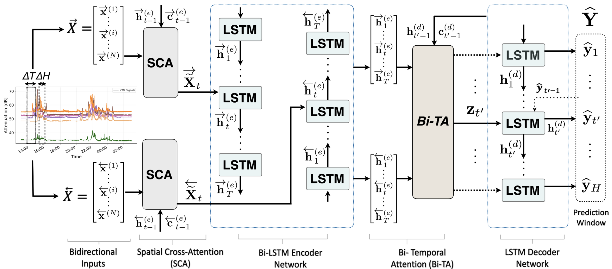
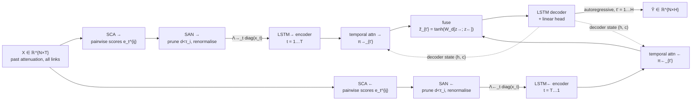
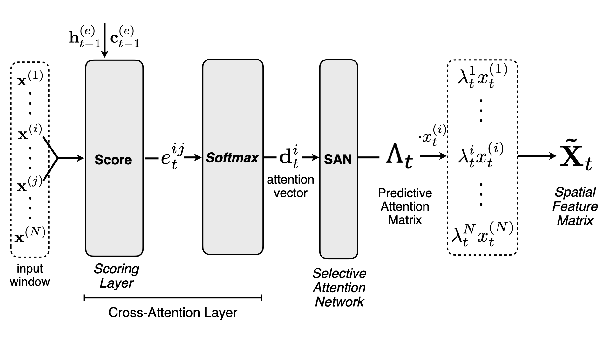
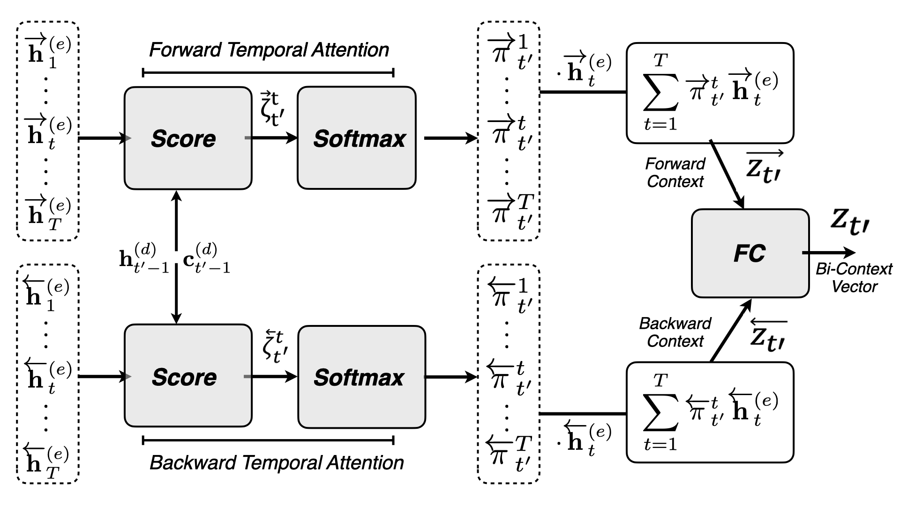

# S-BSTN architecture

S-BSTN is a sequence-to-sequence encoder–decoder built on LSTMs. It applies attention in **two
places** (over space and over time) and in **two directions** (forward and backward through the
input window). Each (place, direction) pair has its own parameters, and the directions are
merged only once, at the context vector.





## Notation

| Symbol | Meaning | Shape |
|---|---|---|
| `N` | links (sensors) in the subnetwork | |
| `T` | input window, past steps | |
| `H` | forecast horizon, future steps | |
| `M` | LSTM hidden size (encoder = decoder) | |
| `Q_e`, `Q_d` | spatial / temporal attention inner size | |
| `x_t^{(i)}` | attenuation of link `i` at step `t`, dB (`TSL − RSL`) | scalar |
| `X`, `Y` | input window / target window | `N×T`, `N×H` |
| `Λ_t` | spatial attention at step `t`, row `i` = distribution over sources `j` | `N×N` |
| `τ` | per-target selection threshold | `N`, each in (0, 1) (`absolute`) or (0, 2/N) (`uniform`) |
| `π_{t'}` | temporal attention for forecast step `t'` | `T` |

## 1. Selective cross-attention (SCA): *which links matter to which*



Standard spatial attention gives each sensor a single importance weight. SCA instead scores
**ordered pairs**. Entry `(i, j)` is the influence of source `j` on the forecast for target `i`:

```
e_t^{ij} = v_eᵀ tanh( W_e [h_{t−1}; c_{t−1}] + U_s x^{(i)} + V_s x^{(j)} + b_e )
d_t^{ij} = softmax_j ( e_t^{ij} )
```

`U_s` projects the target's whole input series and `V_s` projects the source's, which is what
makes the score pairwise. The recurrent state `[h_{t−1}; c_{t−1}]` lets the attention change
from step to step as a storm moves through the window.

Code: [`sbstn/models/sca.py`](../sbstn/models/sca.py). `U_s X` and `V_s X` do not depend on
`t`, so they are computed once per forward pass rather than at every step.

## 2. Selective attention network (SAN): *prune what cannot help*

```
d̃_t^{ij} = d_t^{ij} · 1[ d_t^{ij} ≥ τ_i ]
Λ_t^{ij}  = d̃_t^{ij} / Σ_k d̃_t^{ik}
```

`τ_i` is a **learned**, per-target threshold. Each link therefore reads from a sparse set of
sources that it chooses itself and that is renormalised. A dense softmax always gives every
source some weight. SAN can set to exactly zero the sources that are outside the storm's
correlation length, or whose lead time does not fit within the forecast horizon
(see [spatio-temporal scales](spatiotemporal.md)).

Implementation details that matter:

- **Straight-through gradient.** The hard indicator has zero gradient with respect to `τ`
  almost everywhere. Implemented literally, `τ` would train but never leave its
  initialisation. The forward pass uses the hard mask. The backward pass uses
  `σ((d − τ)/temperature)`.
- **Initialisation below uniform.** `τ₀ = 0.5/N`, which is under the uniform weight `1/N`, so
  no row is empty at step 1.
- **Empty-row guard.** If `τ_i` exceeds every weight in row `i`, the row falls back to its
  single strongest source. The rate at which this happens is logged as `empty_row_rate`.
- **Threshold units** (`model.tau_scale`). `absolute` compares `τ ∈ (0,1)` directly against
  the softmax weights, as in the paper. `uniform` measures `τ` in units of `1/N`, so a learned
  value means the same thing at any network size.

The spatial feature is the matrix form `X̃_t = Λ_t · diag(x_t)`. Entry `(i, j)` is the
source's reading `x_t^{(j)}` weighted by its relevance to target `i`. With
`spatial_reduce: rowsum` (the default), each row is summed to give an attention-weighted
reading of length `N` per target. With `flatten`, the whole `N×N` matrix is fed to the LSTM.

## 3. Bidirectional encoder

```
h→_t = LSTM→( h→_{t−1}, X̃→_t )     t = 1 … T
h←_t = LSTM←( h←_{t+1}, X̃←_t )     t = T … 1
```

Each direction has its own SCA, SAN, `τ` and LSTM cell. This is why the encoder is two
`LSTMCell`s rather than `nn.LSTM(bidirectional=True)`: that API cannot give each direction its
own spatial attention. Backward outputs are stored by **real time**, so attention maps from
the two directions line up.

**No leakage.** Both directions read only `X`, the observed past. The backward pass traverses
data that has already been observed, in reverse order. It never sees `Y`.

Code: [`sbstn/models/encoder.py`](../sbstn/models/encoder.py).

## 4. Bi-temporal attention (Bi-TA): *which moments matter*



For every forecast step `t'`, each direction scores every encoder step against the current
decoder state:

```
ζ_{t'}^{t} = v_dᵀ tanh( W_d [c^{(d)}_{t'−1}; h^{(d)}_{t'−1}] + U_d h^{(e)}_t + b_d )
π_{t'}     = softmax_t ( ζ_{t'} )
z_{t'}     = Σ_t π_{t'}^{t} h^{(e)}_t
z̃_{t'}     = tanh( W [z→_{t'}; z←_{t'}] + b )
```

The two directions are fused **once**, at the context vector. The ablation variant V2
removes temporal attention entirely: its context is the fused final encoder states, constant
across `t'`. `U_d` is `Q_d × M`, so that `U_d h` lands in `ℝ^{Q_d}`.

Code: [`sbstn/models/bita.py`](../sbstn/models/bita.py).

## 5. Decoder and head

```
h^{(d)}_{t'} = LSTM( h^{(d)}_{t'−1}, [ŷ_{t'−1}; z̃_{t'}] )
ŷ_{t'}       = W_y [z̃_{t'}; h^{(d)}_{t'}] + b_y        ∈ ℝ^N
```

The decoder is autoregressive. It starts from the last observed slice `x_T`, and its initial
state is a learned projection of the final encoder states. The head is linear so that it can
produce an unbounded continuous output. An optional `residual_head` predicts the change from
`ŷ_{t'−1}` instead of the absolute level.

Loss: squared error summed over `N × H` (the paper), or averaged (`loss_reduction: mean`, the
default, which makes the learning rate independent of `N`), plus weight decay.

Code: [`sbstn/models/decoder.py`](../sbstn/models/decoder.py),
[`sbstn/models/sbstn.py`](../sbstn/models/sbstn.py).

## Ablation variants

All variants are presets of the same class, `sbstn.VARIANTS`:

| Variant | Spatial attn | SAN | Temporal attn | Bidirectional |
|---|:-:|:-:|:-:|:-:|
| **S-BSTN** | ✓ | ✓ | ✓ | ✓ |
| S-BSTN-V1 | – | – | ✓ | ✓ |
| S-BSTN-V2 | ✓ | ✓ | – | ✓ |
| S-BSTN-V3 | ✓ | – | ✓ | ✓ |
| S-BSTN-V4 | ✓ | ✓ | ✓ | – |
| STANN | ✓ | – | ✓ | – |
| LSTM-ED | – | – | – | – |

```bash
sbstn train --config configs/quickstart.yaml --variant S-BSTN-V3 --out runs/v3
```

## Complexity

SCA is `O(T · N² · Q_e)` per direction. The `(B, N, N, Q_e)` score tensor is kept for the
backward pass at every step. For large networks, `model.chunk_size` splits the target axis
into chunks, which gives identical results with bounded peak memory. The encoder is a Python
loop over `T` steps with small kernels, so for these model sizes a CPU is often as fast as a
GPU.
