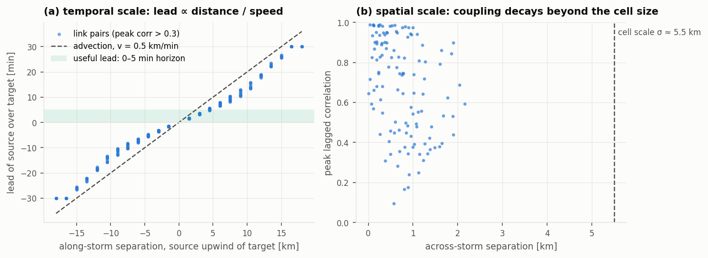

# Spatio-temporal structure: why S-BSTN is built this way

Each part of S-BSTN corresponds to a physical property of how rain crosses a network of
microwave links. This page states those properties and shows which component handles each
one.

## 1. A CML measures a line integral of a 2-D field

Rain is a field `R(x, y, t)` over the ground plane. A commercial microwave link between
endpoints `a` and `b` does not sample that field at a point. Its excess attenuation is the
path integral of the specific attenuation along the link:

```
A^{(i)}(t) = ∫_{a_i}^{b_i} k · R(s, t)^α ds  ≈  L_i · k · r̄^{(i)}(t)^α     [dB]
```

`k` and `α` are the ITU-R P.838 coefficients, which depend on frequency and polarisation.
`L_i` is the path length and `r̄^{(i)}` is the path-averaged rain rate. The observed signal
adds a slowly drifting baseline, wet-antenna attenuation that lingers after rain stops,
thermal noise and 0.3 dB quantisation.

Two consequences follow:

- **Each sensor is a spatial filter.** Links are oriented segments of different lengths
  (1–8 km), not points. Two links with nearby midpoints can still see different rain if one
  of them runs along the storm and the other across it. A fixed distance kernel cannot
  represent this. A learned, pairwise score can.
- **The network is a sparse, irregular sampling of a 2-D field.** It has no grid, so the
  field has to be reconstructed from line integrals.
  [`sbstn.evaluate`](../sbstn/evaluate.py) does this as a downstream step: attenuation →
  path-averaged rain rate → IDW rain map.

## 2. Rain fields evolve on coupled spatial and temporal scales

Convective rain is organised into cells that are typically a few km across. They are
**advected** by the steering wind at tens of km/h while they grow and decay over tens of
minutes. To first order this is Taylor's frozen-turbulence picture, `R(x, t+Δt) ≈ R(x − vΔt, t)`,
corrected for cell growth and decay. It sets two scales that every forecaster has to respect:

| Scale | Physical origin | Typical value | Consequence for link pairs |
|---|---|---|---|
| **Spatial** correlation length `ℓ` | rain-cell size | 3–8 km | links further apart than `ℓ` barely co-vary |
| **Temporal** lead `Δt_{ij} = d_{ij}^{∥} / ‖v‖` | advection over the along-wind separation | minutes | an upwind link *leads* a downwind one |
| **Lifetime** `τ_cell` | growth and decay | 20–90 min | lead-lag coupling weakens as `Δt_{ij}` → `τ_cell` |
| **Forecast horizon** `H·Δt` | the task | 1–5 min | only sources with `0 ≤ Δt_{ij} ≤ H·Δt` carry *new* information |

These scales can be measured directly from a simulated rain field
(`viz.plot_spatiotemporal_structure`):



In panel (a), the lead of a source over a target grows with their along-storm separation, and
upwind sources lead. The shaded band marks the leads that fall within a 5-minute horizon.
In panel (b), coupling decays with separation on the scale of the rain cells.

Together, these define the **useful influence set** for each target link `i`:

```
𝒮_i = { j :  j is upwind of i,  0 ≤ d_{ij}^{∥}/‖v‖ ≤ H·Δt,  d_{ij}^{⊥} ≲ ℓ }
```

The simulator computes this set explicitly as the ground-truth influence matrix `Λ*`
([`reference_influence`](../sbstn/data/simulate.py)). It is what S-BSTN's spatial attention
should recover.

## 3. How each component maps onto these scales

| Physical requirement | Component | Mechanism |
|---|---|---|
| Influence is **pairwise and directional**: *j → i* is not *i → j* | **SCA** | scores ordered pairs `(i, j)` from both links' series, so `Λ^{ij} ≠ Λ^{ji}` |
| Only sources **within the correlation length and the horizon** help; the rest add noise | **SAN** | learned per-target threshold `τ_i` sets out-of-range sources to exactly zero and renormalises |
| Which sources matter **changes as the storm crosses** the window | recurrent SCA | scores are conditioned on the encoder state `[h_{t−1}; c_{t−1}]`, so `Λ_t` varies over `t` |
| Relevant **past lags** depend on the lead and on the forecast step | **Bi-TA** | each forecast step `t'` gets its own distribution `π_{t'}` over past steps |
| **Onset and decay** look different depending on which end of the window you read from | **bidirectional** encoder | separate forward and backward SCA + LSTM, fused only at the context vector |
| Links have **different baselines**, so their dB values are not comparable | per-link scaling | min-max scaler fitted per link on training data only |

This is also why the ablations are informative:

- **V3** (no SAN) keeps pairwise attention but cannot drop far-away links.
- **V1** (no spatial attention) feeds the raw `N`-vector straight into the LSTM, so links
  can no longer be weighted pairwise or pruned.
- **V4** (forward only) loses the backward view of onset and decay.

In the paper, the benefit of SAN depends on geometry. It helps on the larger, spatially
extended subnetworks, where many links fall outside a target's influence set. It does not
help on the small, tightly clustered ring, where every link sees the same weather and there
is nothing to prune.

## 4. Seeing it in a trained model

```python
from sbstn import Forecaster
from sbstn import viz

fc = Forecaster.load("runs/quickstart/sbstn.pt")
attn = fc.attention(x_windows)                      # x_windows: (B, N, T) dB
lam = attn["lambda_fwd"].mean(0)                    # (N, N), time-averaged
viz.plot_spatial_attention(fc.links, lam, target=8) # arrows: sources → link 8
viz.plot_temporal_attention(attn["pi_fwd"], attn["pi_bwd"], fc.dt_min)
```

On simulated data the learned `Λ` can be compared directly with the ground truth `Λ*`
(`viz.plot_attention_matrices`), and
[`metrics.attention_recovery`](../sbstn/metrics.py) summarises how well it matches:
top-k overlap, row correlation, and the attention mass placed on upwind sources.
